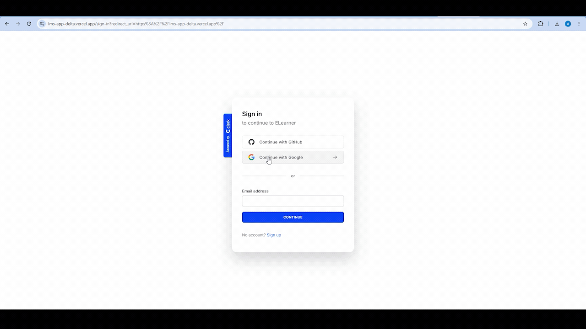
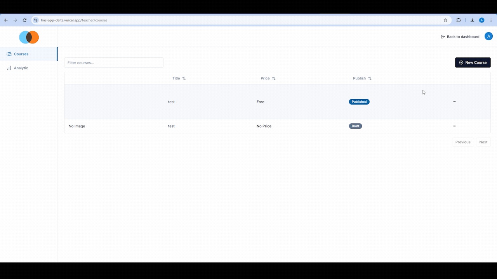

# ELearner

<!-- Add Badges here -->


Welcome to **ELearner**! This project is a comprehensive Learning Management System built to provide a seamless educational experience with video streaming, course management, and secure payments.

**[🚀 View Live Demo](#)** <!-- Replace with actual link -->

## 🌟 Overview

I built this project to create a robust platform for online education. It features student and teacher modes, enabling content creators to publish courses with video lessons and attachments, while students can track their progress, purchase courses, and learn effectively.

## 📸 Demos & Previews

### 🎓 Student Experience & Course Player
*Seamless course discovery, interactive video streaming with Mux, chapter progress tracking, and purchase flow.*



---

### 👨‍🏫 Teacher Dashboard & Analytics
*Comprehensive educator controls with real-time revenue analytics, sales insights, and course performance.*



---

### 🛠️ Course & Chapter Creation
*Intuitive course editor with drag-and-drop chapter reordering, rich text descriptions, and instant video uploads.*


## 🚀 Key Features

- **Authentication**: Secure login and registration powered by Clerk.
- **Video Streaming**: High-quality video delivery and playback using Mux.
- **Course Management**: Intuitive drag-and-drop course and chapter reordering.
- **Rich Text Editor**: Create engaging course descriptions with React Quill.
- **Secure Payments**: Integrated Stripe checkout for course purchases.
- **File Uploads**: Seamless image and attachment uploads via Uploadthing.
- **Student Progress**: Visual progress tracking with charts and progress bars.

## 🛠️ Tech Stack

- **Framework**: <a href="https://nextjs.org/" target="_blank">Next.js 14</a> + <a href="https://react.dev/" target="_blank">React 18</a>
- **Styling**: <a href="https://tailwindcss.com/" target="_blank">Tailwind CSS</a> + <a href="https://www.radix-ui.com/" target="_blank">Radix UI</a>
- **Database / ORM**: <a href="https://www.prisma.io/" target="_blank">Prisma</a>
- **Authentication**: <a href="https://clerk.com/" target="_blank">Clerk</a>
- **Payments**: <a href="https://stripe.com/" target="_blank">Stripe</a>
- **Video Hosting**: <a href="https://mux.com/" target="_blank">Mux</a>
- **File Uploads**: <a href="https://uploadthing.com/" target="_blank">Uploadthing</a>

## 📂 Getting Started

### Prerequisites

Make sure you have Node.js installed on your machine. You will also need API keys for Clerk, Stripe, Mux, Uploadthing, and a database connection URL.

### Installation

1. Clone the repository:
   ```bash
   git clone https://github.com/AsadBulediReal/lms-app.git
   ```
2. Navigate to the project directory:
   ```bash
   cd lms-app
   ```
3. Install the dependencies:
   ```bash
   npm install
   ```
4. Set up environment variables:
   Create a `.env` file in the root directory and add the required API keys and database URL.

5. Initialize the database:
   ```bash
   npx prisma generate
   npx prisma db push
   ```

### Running Locally

```bash
npm run dev
```
The app will be available at `http://localhost:3000`.

## 📬 Contact

Created by **<a href="https://github.com/AsadBulediReal" target="_blank">Asad Jamil Buledi</a>** - feel free to reach out!
- LinkedIn: <a href="https://www.linkedin.com/in/asad-jamil-buledi" target="_blank">Asad Jamil Buledi</a>
- GitHub: <a href="https://github.com/AsadBulediReal" target="_blank">AsadBulediReal</a>
- Email: <a href="mailto:bulediasadjamil@gmail.com" target="_blank">bulediasadjamil@gmail.com</a>
